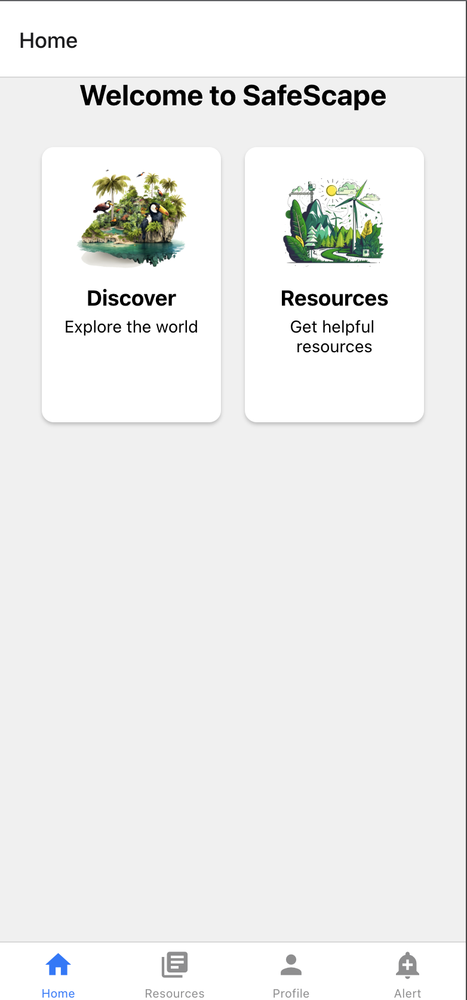
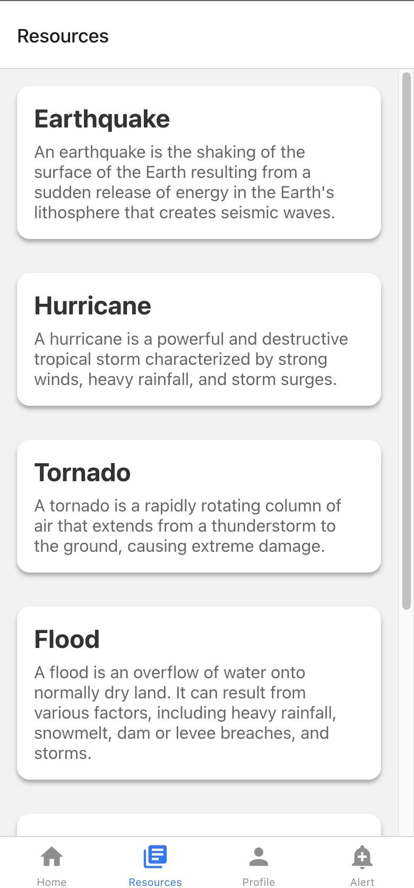
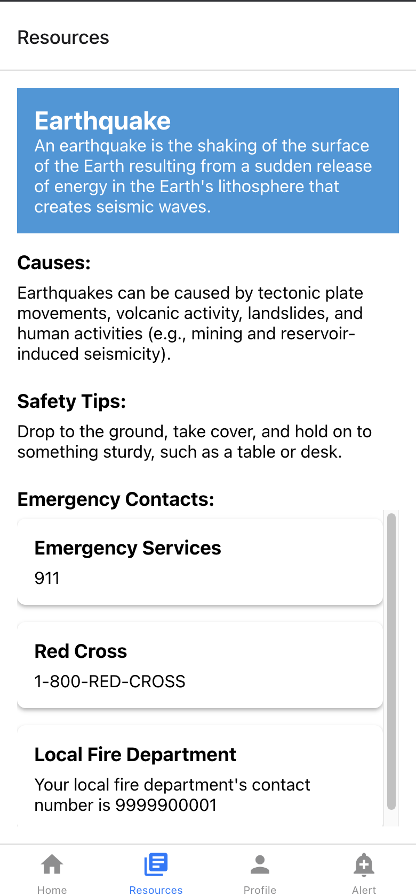

# SafeScape - Disaster Preparedness & Alerts


## Table of Contents

- [SafeScape - Disaster Preparedness \& Alerts](#safescape---disaster-preparedness--alerts)
  - [Table of Contents](#table-of-contents)
  - [Introduction](#introduction)
  - [Features](#features)
  - [Getting Started](#getting-started)
    - [Prerequisites](#prerequisites)
    - [How to run the project](#how-to-run-the-project)
    - [App](#app)
    - [Server](#server)
  - [Contributing](#contributing)
    - [How to Contribute](#how-to-contribute)
  - [Additional details](#additional-details)
    - [Authors](#authors)
    - [License](#license)
  - [Screen Shots](#screen-shots)

## Introduction

SafeScape is an innovative mobile app designed to help users prepare for and stay protected during natural disasters and severe weather events. It offers a comprehensive set of features to educate users about disaster preparedness, provide real-time disaster alerts, and facilitate community support during crises.

This README provides an overview of the app, its key features, and how to get started with development or usage.

## Features

SafeScape offers the following key features:

1. **Educational Resources:**

   - A library of articles, videos, and infographics to educate users about different types of natural disasters.
   - Step-by-step guides for creating personalized emergency plans for individuals, families, and pets.

2. **Alert Notifications:**

   - Real-time alerts from national or regional alert systems.
   - Notifications sent to users when a disaster or severe weather event is imminent or occurring in their location.

3. **Interactive Maps:**

   - Live maps with disaster tracking, showing the location and movement of storms, wildfires, earthquakes, and other natural disasters.

4. **Emergency Contacts:**

   - A list of important emergency contacts and resources, including local emergency services, shelters, and hospitals.

5. **Community Chat & Support:**

   - A community chat feature to enable users to connect with others in their area.
   - Sharing of information and mutual support during and after disasters.

6. **Check-In Feature:**

   - Users can check in as "safe" to reassure their loved ones during a disaster, particularly valuable during events like hurricanes or earthquakes.

7. **Offline Access:**

   - Critical information, including emergency plans and contact details, can be accessed offline.

8. **Multi-Language Support:**
   - Support for multiple languages to cater to a diverse user base.

## Getting Started

### Prerequisites

Before you begin contributing to the project, make sure you have the following installed:

- [Node.js](https://nodejs.org/) and [npm](https://www.npmjs.com/)
- A modern code editor like [Visual Studio Code](https://code.visualstudio.com/)

### How to run the project

This repository contains two main components:

- **Client**: The frontend application (Expo + TypeScript + Tailwind).
- **Server**: The backend server (Prisma + Sqlite).

Follow the steps below to get a copy of the project up and running on your local machine:

1. Fork and clone this repository.

   ```
   git clone https://github.com/shubhamm69/SafeScape
   ```

2. Navigate to the project directory.

   ```
   cd SafeScape
   ```

### App

1. Open your terminal.
2. Navigate to the `app` directory using the `cd` command:

   ```
   cd client
   ```

3. Install the necessary dependencies using your package manager of choice (npm, yarn, pnpm or bun):

   ```
   npm i
   ```

4. To start the application, run the following command:

   ```
   npx expo start
   ```

5. Scan the QR with your phone and start using the app

### Server

1. Open your terminal.

2. Navigate to the `server` directory using the `cd` command:

   ```
   cd server
   ```

3. Install the necessary server dependencies using your package manager of choice (npm, yarn, pnpm or bun):

   ```
   npm i
   ```

4. To start the server, run the following command:
   ```
   npm run dev
   ```

The local server will be up and running on `http://localhost:3000`.

## Contributing

We welcome contributions from the open-source community!
By contributing, you can help us improve the SafeScape Applciation.

### How to Contribute

Please read [CONTRIBUTING.md](CONTRIBUTING.md) for details on our code of conduct, and the process for submitting pull requests to us.

## Additional details

### Authors

<a href="https://github.com/shubhamm69/SafeScape/graphs/contributors">
  
</a>

### License

This project is licensed under the Apache 2 License - see the [LICENSE](LICENSE) file for details.

## Screen Shots




